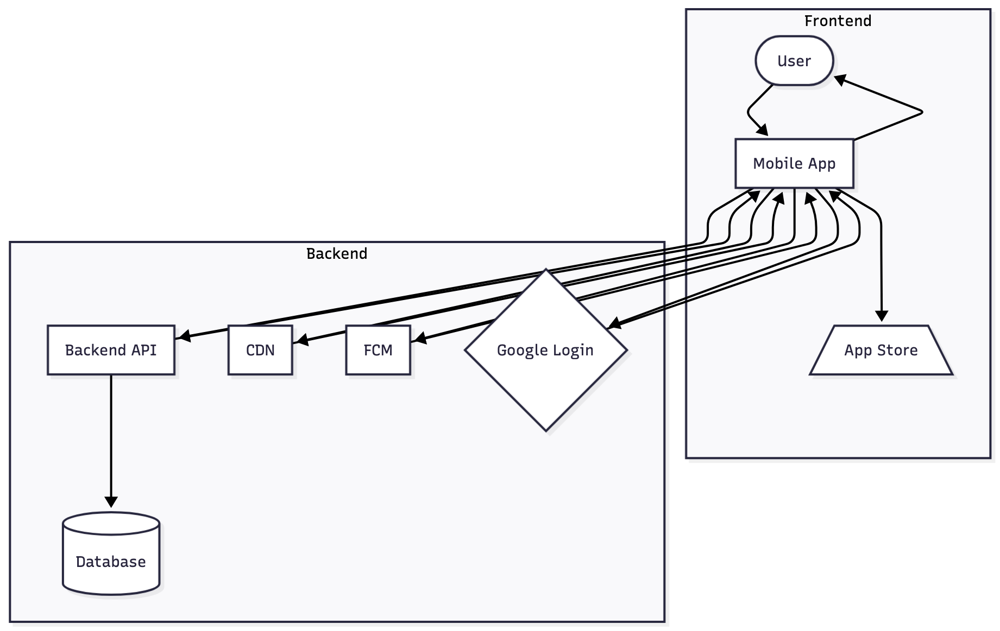

# Mobile Application Testing – Technical Information

**Organization:** AI TECHNOLOGIES PLC / ኤ አይ ቴክኖሎጂስ ኋላ/የተ/የግ/ማ  
**Platform:** OnTime Ethiopia (Mobile Application)

---

## 1. Business Architecture and Design / Ecosystem of Mobile Applications

### 1.1 Background of the Organization

AI TECHNOLOGIES PLC (ኤ አይ ቴክኖሎጂስ ኋላ/የተ/የግ/ማ) is an Ethiopian technology company focused on building digital platforms that support media, communication, and innovative services aligned with Ethiopia’s digital transformation agenda. The company delivers scalable software solutions and streaming platforms for local and regional audiences.

### 1.2 Introduction

This document provides technical and security-related information about the OnTime Ethiopia **mobile application**. It is intended to support the Information Network Security Administration (INSA) in planning and executing penetration testing and security assessments for the mobile app.

### 1.3 Objective

The objective is to obtain an independent security assessment and certificate for the OnTime Ethiopia mobile application, verifying that it has been tested against common mobile and web-service vulnerabilities and that identified issues can be remediated to strengthen the platform’s overall security posture.

### 1.4 Business Architecture (Mobile App)

- **Product:** OnTime Ethiopia – a mobile OTT/streaming application providing live TV, shorts, and related content to end users.  
- **Core actors:**  
  - Mobile end users (Android) consuming video content via the app.  
  - Backend services (Django REST API) providing authentication, content metadata, and streaming URLs.  
- **Core backend:** Django REST Framework application exposing REST APIs for channels, live TV, shorts ingestion, playlists, and authentication.  
- **Mobile client:** Flutter-based application consuming these APIs over HTTPS.

### 1.5 Data Flow Diagram (Text Description)

1. The OnTime Ethiopia mobile app (Flutter client) connects to the backend over HTTPS.
2. The mobile app authenticates the user (for protected features like login, account management) and stores an auth token or session-related data securely (according to platform best practices).
3. The mobile app sends REST API requests to the Django backend (e.g. `/api/channels/`, `/api/live/`, `/api/channels/shorts/ready/feed/`, `/api/auth/login/`).
4. The backend reads/writes data from the application database (e.g. PostgreSQL), including user accounts, channels, playlists, live metadata, and shorts jobs.
5. For media playback, the mobile app receives HLS playlist URLs from the backend and then streams audio/video content from streaming endpoints/CDN over HTTPS.
6. Background analytics and error logging (if enabled) may send telemetry from the mobile app to backend logging/monitoring services.

### 1.7 Mobile Application Data Flow Diagram (PNG)

The following figure shows the same data flow as a rendered diagram image:

### 1.8 System Architecture Diagram with Database Relation (Text Description)

- **Mobile Client Layer**  
  - OnTime Ethiopia Flutter app running on Android devices.  

- **Application Layer**  
  - Django REST API application that handles authentication, authorization, content listing, and live/shorts metadata.  
  - Celery workers for background processing (shorts ingestion, transcoding, and housekeeping).  

- **Data Layer**  
  - Relational database (e.g. PostgreSQL) storing user profiles, playlists, channels, live metadata, and shorts ingestion jobs.  
  - Object storage / CDN hosting media artifacts (HLS playlists, thumbnails, logos).  

The mobile app never accesses the database directly; all access is via authenticated and authorized API calls to the backend.

### 1.9 Native, Hybrid, and PWA Classification (Mandatory)

- **Native applications:**  
  - OnTime Ethiopia mobile app is built with **Flutter** and compiled to native Android binaries (APK/AAB). It uses native rendering and integrates with platform-specific components (e.g. video player plugins).  

- **Hybrid applications:**  
  - The application is **not** implemented as a traditional hybrid app (e.g. Cordova/PhoneGap) using a WebView for the entire UI. It is a Flutter app compiled to native code.  

- **Progressive Web Apps (PWA):**  
  - OnTime Ethiopia mobile is not a PWA; it is a store-installed native app. The PWA model is not used for this mobile client.  

### 1.10 Threat Model Mapping (High-Level)

- **Assets:**  
  - User accounts and authentication credentials.  
  - Access tokens / session identifiers stored on the device.  
  - Streaming URLs and content metadata.  
  - Configuration and feature flags.  

- **Threats (examples):**  
  - Interception of network traffic (MitM) if HTTPS is not enforced or improperly configured.  
  - Compromise of stored tokens or sensitive data on the device.  
  - API misuse or bypass of access control by tampering with requests.  
  - Reverse engineering of the APK to gain insight into API endpoints and business logic.  

- **Mitigations (examples):**  
  - Use of HTTPS for all mobile–backend communication.  
  - Server-side authorization checks for all sensitive operations.  
  - Limited local storage of sensitive data; tokens stored using appropriate APIs and with shortest necessary lifetime.  
  - Obfuscation/minification of Flutter build to make reverse engineering more difficult (as applicable).  

### 1.11 System Functionality (Mobile)

- Login / authentication for end users (e.g. email/password or social login depending on configuration).  
- Browse channels and categories.  
- Watch live TV streams and other media content.  
- Watch shorts (short-form videos) based on a randomized ready feed.  
- View basic metadata (titles, descriptions, thumbnails, channel logos).  
- Interact with playlists and curated content sections.

### 1.12 Role / System Actor Relationship

- **End User (Mobile):**  
  - Registers/logs in, views available content, initiates playback of live streams and shorts.  

- **Backend Services:**  
  - Authenticate end users and issue tokens/sessions.  
  - Enforce authorization for protected resources.  
  - Provide content metadata and streaming URLs.  

- **Admin/Editor (via web admin, not directly in mobile app):**  
  - Creates/manages content that the mobile app consumes (channels, playlists, shorts).  

### 1.13 Test Accounts (Mandatory)

The following types of test accounts will be provided to the testers:

- **End-user account (mobile):**  \
  - A standard user account with access to typical content and features in the mobile app.  \
  - Testers may use any valid Gmail-based account (email/password) for login, as configured in the app.  \

If additional roles (e.g. beta testers or restricted accounts) exist, they can also be provided for testing.

---

## 2. Purpose and Functionality of the Mobile Application

### 2.1 OS Supported by the Mobile Application

- **Primary supported OS:** Android (mobile devices).  
- Additional platforms (e.g. iOS) can be evaluated or added in the future; Android is the main focus for current testing.

### 2.2 Source Code or Binary (APK)

- **Source code:**  
  - Flutter project located under the repository directory (e.g. `Ontime_ethiopia_flutterapp/`).  

- **Binary:**  
  - Android APK/AAB build will be provided to testers for installation on test devices.  
  - The official build can be delivered directly or via store (if already published) as agreed.

### 2.3 Specific Functionalities or Components Requiring Detailed Testing

- Authentication and session handling in the mobile app (login, logout, token management).  
- Secure handling of API endpoints for live TV and shorts playback (including query parameters and authorization).  
- Handling of mixed content or non-HTTPS media URLs (ensuring secure playback where possible).  
- In-app error handling and failure modes when network or backend errors occur.  
- Any in-app configuration or hidden/debug menus (if present).

### 2.4 Compliance or Security Requirements

- Alignment with general security best practices and guidance such as:  
  - OWASP Mobile Application Security Verification Standard (MASVS) – where practically applicable.  
  - Protection against common OWASP Mobile Top 10 risks (insecure communication, insecure authentication, insufficient cryptography, etc.).  
- Protection of user data and credentials, in alignment with local regulatory expectations for privacy and data protection.

### 2.5 Authentication Mechanisms Used in the Mobile Application

- User authentication via the backend (Django) using credentials (e.g. username/email and password) or social login (if enabled).  
- The mobile app stores necessary authentication tokens/sessions securely on the device and attaches them to subsequent API calls.  
- Logout functionality is provided to allow users to terminate sessions from the app.

### 2.6 Sensitive Data Stored or Transmitted by the Mobile Application

- **Stored (device):**  
  - Authentication token / session identifiers (minimal necessary information).  
- **Transmitted:**  
  - User credentials during login (over HTTPS).  
  - User identifiers and session tokens in API requests (over HTTPS).  

### 2.7 Handling of Sensitive Data within the Application

- All communication of sensitive data (credentials, tokens, user identifiers) is performed over HTTPS.  
- The app does not store passwords in plain text on the device.  
- Session tokens or similar secrets are stored using mobile platform mechanisms intended for secure storage (e.g. secure storage plugins where possible) and kept for the shortest necessary duration.  
- Sensitive information is not logged in plaintext in production builds.

### 2.8 Third-Party Services or APIs Integration

- The mobile app mainly communicates with the organization’s backend APIs.  
- Streaming may involve third-party CDNs or streaming providers, accessed via HTTPS URLs delivered by the backend.  
- Authentication may integrate with third-party identity providers (e.g. Google login) depending on configuration.

### 2.9 Restrictions or Limitations on Testing Approach

- Penetration testing of the mobile client should avoid causing denial-of-service to production backend systems; testing windows and rate limits should be agreed in advance.  
- Store policies (if distributed via app stores) must be respected.  
- Any tests that might impact real users or production data should be carefully coordinated.

### 2.10 Known Vulnerabilities or Security Concerns

- No formal external mobile security test has been conducted prior to this request.  
- The purpose of this assessment is to identify potential vulnerabilities such as insecure communication, improper authentication/authorization, insecure storage, or reverse engineering risks.

---

## 3. Scope Definition (Mandatory)

| Name of the Assets to be Audit            | APK/Official Link                                      | Test Account as required by the tester                       |
|-------------------------------------------|--------------------------------------------------------|---------------------------------------------------------------|
| OnTime Ethiopia Android Mobile Application| Official APK/AAB build (to be provided) or store link | Any valid Gmail-based user account (email)         |

For detailed testing activities:

- **Static Analysis:**  
  - Assessment of the APK and, where permitted, review of decompiled code and configuration.  

- **Dynamic Analysis:**  
  - Runtime analysis of the mobile app on test devices/emulators, including network traffic inspection and behavior under various conditions.  

- **Automated Source Code Analysis:**  
  - Optional – if direct access to source code is provided, automated static analysis tools can be used to identify vulnerabilities in the Flutter/Dart code.

---

## 4. Contact Information and Communication Channel

**Company:** AI TECHNOLOGIES PLC / ኤ አይ ቴክኖሎጂስ ኋላ/የተ/የግ/ማ

| Name           | Role      | Address (Email and Mobile)                           |
|----------------|-----------|------------------------------------------------------|
| Elnatan Nebiyou| Developer | Email: elnatan.nebiyu@gmail.com  
|                |           | Mobile: +251911429639                                |

---
